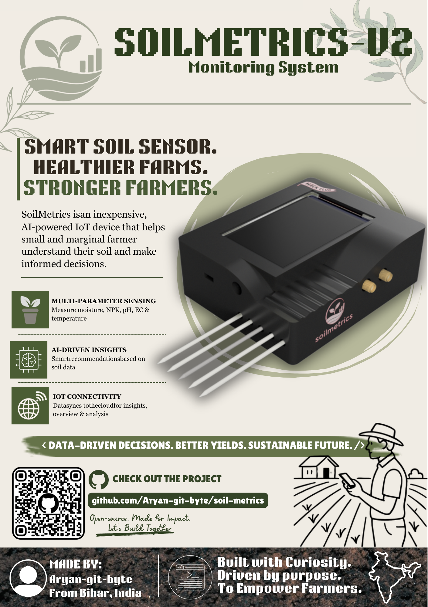
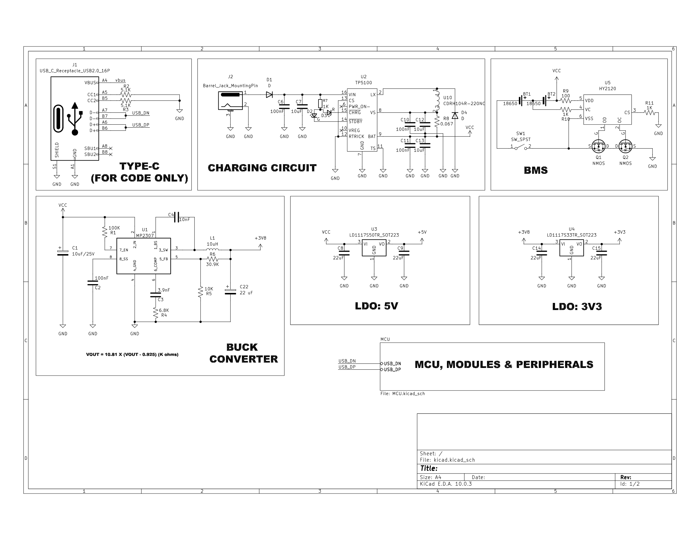
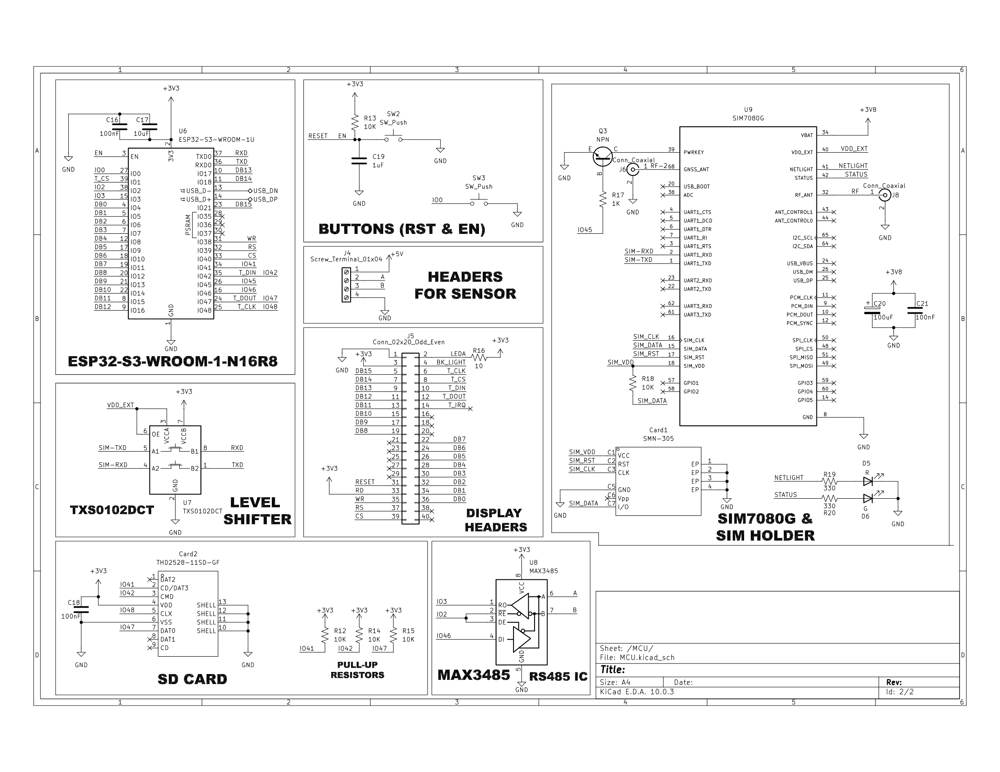
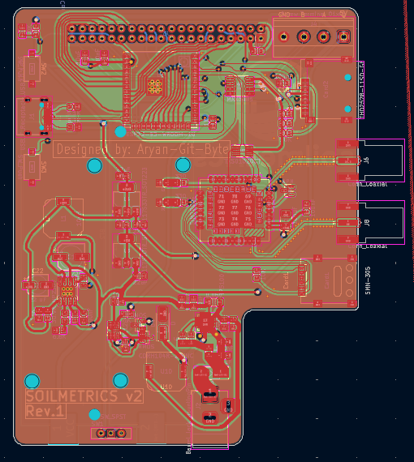
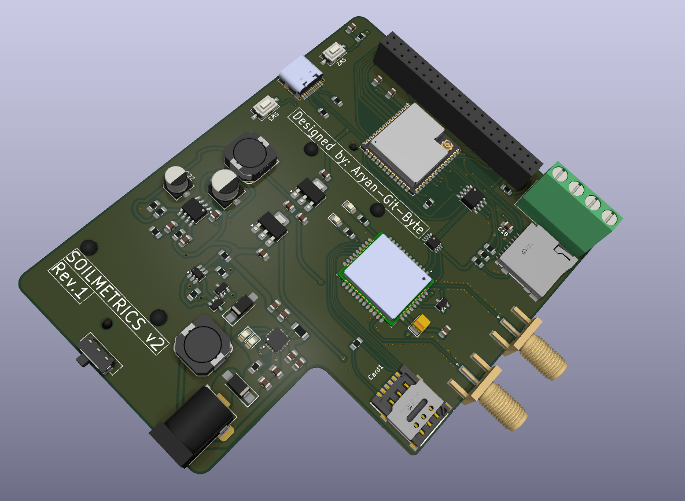
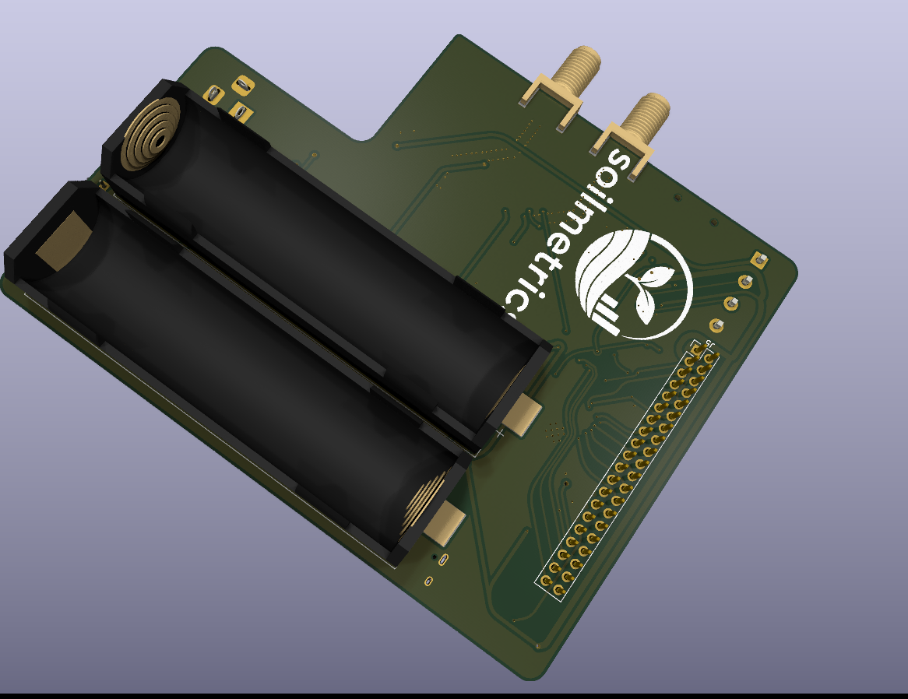

<div align="center">

<h1>SoilMetrics</h1>

[](LICENSE)




<h4><i>A Portable AI & IoT-Based Soil Health Monitoring Device</i></h4>

</div>

---

# Overview:

SoilMetrics is an **affordable soil health monitoring system** to measure key soil parameters in real time such as **NPK, EC, pH, Moisture, and Temperature.** which will allow small farmers to make scientific decision regarding their soil health and conditions which can help them do sustainable farming.

# What can it do?
This device can measure soil moisture, temperature, pH, electrical conductivity, and NPK. and then can send all that data to a cloud server using LTE. it also offers on device touch display to view sensor readings, ai reccomendations, weather reports etc. with help of offline sd card based data logging, and rechargeable 2S 18650 its a near perfect solution to deploy on farmsites for primary soil health monitoring.

## Hardware Specifications:

- **MCU** - [ESP32-S3-WROOM1U-N16R8](https://documentation.espressif.com/esp32-s3-wroom-1_wroom-1u_datasheet_en.pdf)
- **Cellular & GPS** - [SIM7080G](https://www.simcom.com/product/SIM7080G.html)
- **Soil Sensor** - [ZTS-3002-TR-\*-N01](https://robu-prod-media.s3.ap-south-1.amazonaws.com/uploads/2025/04/R224073R224074-ZTS-3002-TR-N01.pdf)
- **Display** - [SmartElex 3.5" TFT Resistive Touch Display 320x480](https://robu.in/product/smartelex-3-5-tft-resistive-touch-display-320x480/)

## Repo Structure:

```
SoilMetrics/
│
├── assets/   images
├── cad/       CAD source files & exports
├── firmware/       ESP-IDF firmware
├── kicad/          kicad source file
├── production/     BOM & gerber
│
├── README.md
├── LICENSE
└── JOURNAL.md
```

---

# Hardware:

## Schematic:


> Contains all the power realted things of the device including Type-c for programming, barrel jack for charging, BMS circuitory, Buck Converter and LDOs


> Contains the MCU, Buttons, LTE module, Receiver, SD card, sim slot etc

## PCB:

The hardware is designed on a 4 layer PCB, The complete design files are available [here](kicad/)





---

# Enclosure
| File | Download Link | Description|
|------|---------------|------------|
|Top Body Enclosure|[here](cad/src/Top-Body.f3d)|This is the source file of the top body
|Bottom plate|[here](cad/src/Bottom-Plate.f3d)|This is the source file of the Bottom plate
|Top Body Enclosure|[here](cad/exports/Top-Body.3mf)|This is the printable file of the top body
|Top Body Enclosure|[here](cad/exports/Bottom-Plate.3mf)|This is the printable file of the top body

---

# Firmware
> **Note:** The complete firmware is not available as of now, there are lot of things that can only be written after making actual hardware, so i will update the repo with complete firmware after build. For now its just a test code.

Configure ESP-IDF

```
idf.py set-target esp32s3
```

Build

```
idf.py build
```

---

## Flashing Firmware

Connect the board using USB.

Flash

```
idf.py flash
```

Open Serial Monitor

```
idf.py monitor
```

If flashing fails, place the board into download mode according to your ESP32-S3 hardware design and retry the command.

---
# How to Assemble

1. order all the components and pcb
2. solder them
3. flash the firmware
4. test it
5. 3d print the enclousure
6. put them all together

## Enclosure:
> Enclosure is not complete yet due to the online unavailability of 3d model of the Display. After getting the display i'll update the repo with correct files

---

# Bill of Materials

The completed BOM of the components used on PCB is in [production/bom.csv](production/bom.csv).

And expect those you need to order these:
|Component | Link | Price | 
|----------|------|-------|
|SmartElex 3.5" TFT Resistive Touch Display 320x480| [here](https://robu.in/product/smartelex-3-5-tft-resistive-touch-display-320x480/)|917 rs
| ZTS-3002-TR-*-N01|[here]( https://robu.in/product/multi-parameter-sensor/)|4396 rs
|2 x 18650 batteries | [here](https://robu.in/product/sony-vtc6-18650-li-ion-3000-mah-battery/)|699 rs each
| PCB + Stencil | | Sub-8K rs

---

*Made with 🔬🧪 ~~(science)~~ by aryan-git-byte*

```
# AI USE: AI has assisted me in firmware/
